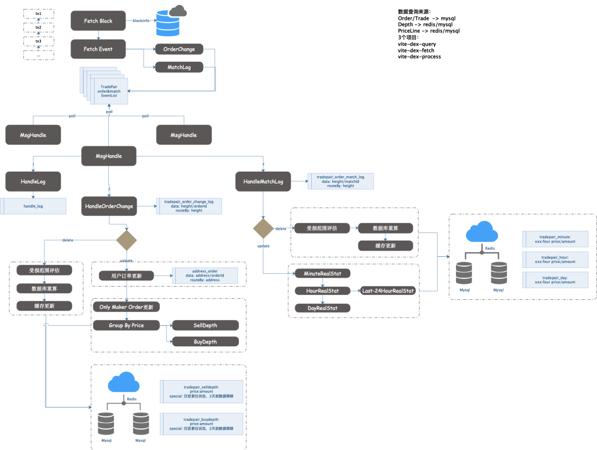

# ViteX后端服务设计及实现

ViteX是Vite链上的内置去中心化交易所，是Vite生态的重要组成部分，ViteX由Vite内置合约vDex和链下服务dexServer两部分组成。所有的挂单、撮合及运营数据全部在链上vDex进行，有效的利用了去中心化、安全、可靠的区块链特性。但链上存储所有数据是非常昂贵的，为了能有效的为用户提供体验，特配套了链下服务DexServer。DexServer服务的目的是同步链上挂单、撮合、运营数据以及统计指标等。DexServer的所有数据都是链上可追溯的，仅仅为ViteX提供查询服务，保证了go-vite代码即协议的原则。

按照职责，把DexServer分为了四个服务，分别是Dex-API、Dex-Crawler、Dex-Push及Dex-Task。其中Crawler是核心服务，为其他三个服务提供数据源，整个系统流程如图所示。

## 1、Dex-API
API服务为ViteX提供了查询入口，是对Crawler服务和Task服务生成的数据的最终聚合。

## 2、Dex-Crawler
Crawler服务是整个系统的核心，把从链上爬取到的数据进行格式化整理之后进行存储，以便其他服务使用。vDex设计为两个合约dexFund及dexTrade，dexFund承担充值、提提开通交易对、开通交易对、挖矿、分红、邀请等操作；dexTrade完成实际的挂单、撮合及撤单。Crawler服务对这两条链分别爬取并进行数据加工，按照需要存储为多个维度。

Crawler业务流程如下图：

crawler服务主要完成三个功能，分别是处理分叉，深度合并及指标统计。跟中心化交易系统有一个本质的区别，区块链存在回滚和分叉，因此，crawler服务的一个主要工作是判断合约链是否分叉，如果分叉则根据分叉高度删除已经持久化的数据，以便同步链上状态。Dex-Crawler服务借助数据库及区块链存在“前一个块”的特性来检测合约链是否存在回滚及分叉，若存在，则对该高度的所有落库的数据进行回滚，保证数据的一致性及正确性。

深度合并是Crawler服务的第二个重点，当有新订单、撤单及撮合事件发生的时候，订单簿就会存在变化，那么表现给用户的就是深度发生变化。深度合并之所以比较复杂，是因为需要对每个交易对进行0到N个价格小数位的数量及金额合并，以及对价格的正确处理。为了提高性能，本服务采用“内存建模”的方式进行深度合并，所有的深度构建在内存中进行，然后将数据送入中间件Kafka，以供下游Dex-Push服务使用。

指标统计是Crawler服务的第三个重点，当新的撮合交易完成时，Kline、Trades以及Tickers这三个指标都会发生变化，其中又以Kline指标较为复杂，需要对不同的时间周期进行数据整理，ViteX支持的时间周期为[ minute , hour , day , minute30 , hour6 , hour12 , week ]。这些指标整理完成之后，都会送入中间件Kafka中，以供下游Dex-Push服务使用。

## 3、Dex-Push
Push服务的主要工作是把Crawler服务中生产出来并写入kafka的数据及时展示给用户。采用多机部署，保证能给用户提供可靠、稳定的服务。另外、为了减少服务端压力，客户端需要在一分钟内对服务端发起ping请求，以声明客户端在线，服务端只会对这些健康的客户端发送数据。

## 4、Dex-Task
本服务主要用于运营数据计算及汇总，交易挖矿、挂单挖矿、邀请挖矿、抵押分红、手续费统计等数据汇总都由定时任务进行离线批处理。

DexServer服务按照不同的职责划分为4个子服务，4个自服务通过异步消息的方式进行数据通信，避免耦合，提高了系统的可靠性和可维护性。之后将会对Crawler及Task中的部分技术细节进行详细介绍，敬请期待。 
