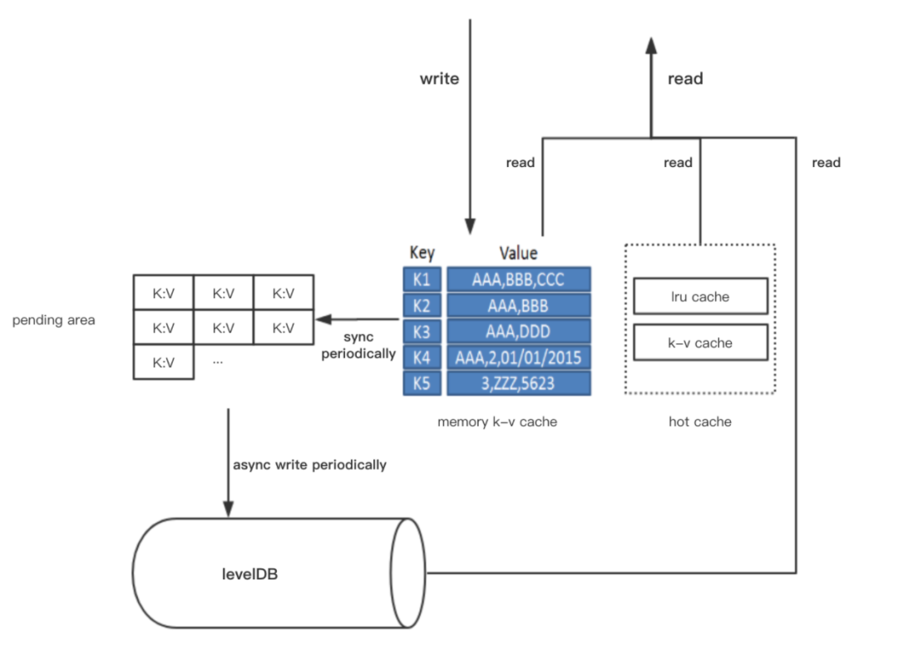

# Vite存储层设计详解之indexDB索引系统设计

indexDB主要通过k-v数据库levelDB来存储账本的索引，索引对象包括账户(Account)、交易(Transaction/AccountBlock)、快照(SnapshotBlock)、SendBlock/ReceiveBlock映射，在levelDB之外还添加了hot cache、memory cache两种类型的缓存提升读取性能，系统整体架构如下。

## 1.读写流程

数据写入时，数据会先写入memory cache，然后周期性(当snapshot block插入时)地将部分数据从memory cache拷贝到pending area中，pending area存储的是待写入levelDB的数据集合，在下次”异步批量Flush“时，会将数据从pending area写入levelDB。
在数据读取时，数据可能存在于hot cache、memory cache、levelDB中，数据读取的效率是hot cache > memory cache > levelDB。

## 2.levelDb索引

levelDB作为一个字节序的kv存储结构，简洁的实现对于固定类型的存储数据来说非常便于优化。通过预定义的key字节结构，有效的将同一类型的数据进行物理的排序，能够充分发挥底层硬件性能。
具体实现是通过定义不同的字节前缀将不同的数据类型进行物理的分段，需要的话每个类型的数据还可以在这个基础上定义自己的子前缀，从而实现不同子类型数据结构的有序聚簇存储。

## 3.hot cache与memory cache缓存

hot cache是一个高速读缓存，经常读取到的热数据会缓存于hot cache中，以提高整体的读性能。memory cache是一个写暂存区，会暂存最近写入的数据，因而在memory cache中的部分数据可能还未写入levelDB，而通过一定的设计，使得无论数据存储在memory cache还是levelDB中，插入、删除、读取、更新、迭代等操作都是一致的，因而对于上层模块而言，写入memory cache数据即是可读的。

## 4.pending area与redo log

pending area暂存准备写入levelDB的数据。”异步批量Flush“触发时，数据会从pending area写入levelDB，先写redo log再写入levelDB，redo log在逻辑上记录的是数据操作顺序，如"put k1 v1; put k2 v2; put k1 v2; delete k3..."，多次执行同一个redo log是幂等的。

## 5.索引维度

通过分析每种类型的数据读写场景，并有针性的定义最适合的维度，在数据写入时多个维度的索引会分别写入，这样每个场景的的读取效率都会因为有了最优的索引而得到保证。
