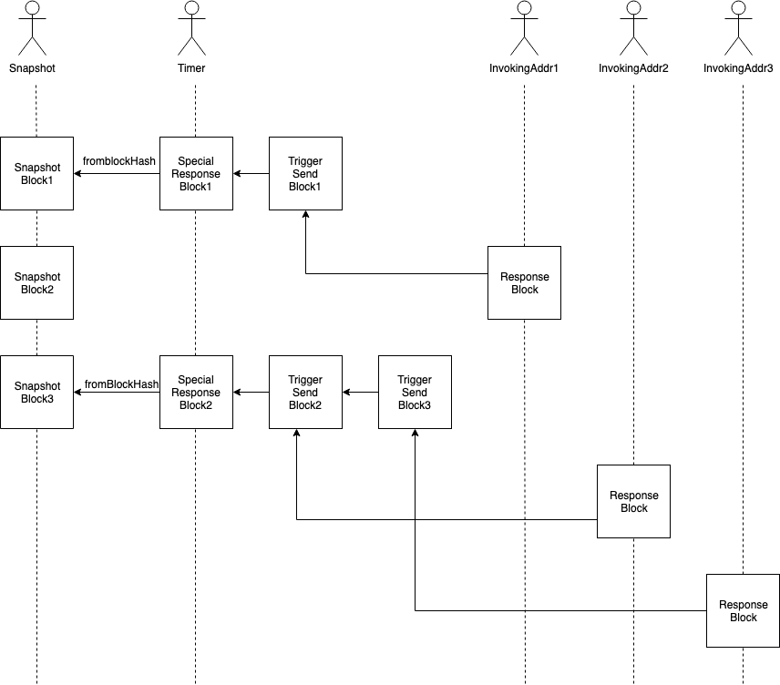

# VEP 19: 定时任务

## 使用场景

定时任务是为了实现在Vite链上定期发交易，或者延时发交易的一种去中心化方案。例如，共识信息合约定期发放超级节点奖励，交易所合约定期删除过期订单，小游戏合约延期开奖等。

## 使用说明

用户在注册一个定时任务时，给定时任务合约发送一笔请求交易，支付一定的费用，并填写相关参数。请求交易哈希即为定时任务id。当达到任务触发条件时，定时任务合约会主动向交易接收地址发起一笔请求交易，调用指定接口，并传入任务id和触发条件。

定时任务参数包括：

* 触发类型：按时间触发/按快照块高度触发
* 开始时间或高度：第一次触发的时间或高度，如果填历史时间或高度，则以此为基准计算第一次触发时间或高度
* 触发间隔：触发时间间隔/触发高度间隔，时间间隔不低于一轮（即75s），高度间隔不低于75个快照块
* 触发窗口：触发时间窗口/触发高度窗口，时间窗口不低于一轮（即75s），高度窗口不低于75个快照块，触发窗口小于等于触发间隔。如果在窗口内未触发，则跳过本次触发
* 结束条件类型：到达指定时间或高度后结束/触发若干次后结束/永不结束
* 结束条件：指定时间或高度/触发次数/-
* 如何计算下一次触发：按固定间隔触发/按实际触发时间或高度顺延
* 交易接收地址
* 退款地址

注册定时任务时支付的费用包括：
* 注册费用：10`vite`
* 触发费用：10`vite`/次，注册时至少充值一次，触发定时任务时扣除并不定期销毁，定时任务到达结束条件时自动退还

注册成功的定时任务可以删除，删除时退还未使用的充值金额。已欠费的任务会停止执行，直到重新充值，欠费超过7天的任务会被自动删除。

以共识信息合约定期发放超级节点奖励为例，触发类型为按时间触发，开始时间为创世时间+1小时，即`2019-5-21T13:00:00+0800`，触发间隔为24小时，触发窗口为24小时，永不结束，按固定间隔触发，交易接收地址为共识信息合约。

如果注册时间为`2019-8-21T10:00:00+0800`，那么第一次触发时间在`2019-8-21T13:00:00+0800`到`2019-8-22T12:59:59+0800`之间，触发时会调用共识信息合约的指定接口，并扣除10`vite`充值余额。

如果在`2019-8-21T13:00:00+0800`到`2019-8-22T12:59:59+0800`之间没有触发，则跳过本次触发。

第二次触发时间在`2019-8-22T13:00:00+0800`到`2019-8-23T12:59:59+0800`之间。

## 实现原理

定时任务合约是一个内置合约，定时任务合约链的响应交易由公共委托共识组的节点出块。

定时任务合约链上有两种类型的响应交易，一类是普通的响应交易，用于响应定时任务的注册、充值和删除交易；另一类是定时任务的触发交易，用于主动触发定时任务。

定时任务的触发交易是一种特殊的响应交易，没有对应的请求交易，这种交易本质上是由快照块出块触发的（显式依赖一个快照块），当公共委托共识组的出块节点检测到快照块增长事件时，会尝试依赖这个快照块出一个定时任务触发交易，根据快照块高度和时间依次触发满足触发条件的定时任务，删除欠费到期的定时任务，销毁触发定时任务的费用。

触发定时任务时，快照块、定时任务触发交易块、业务响应交易块的依赖关系如下图：

图 1

